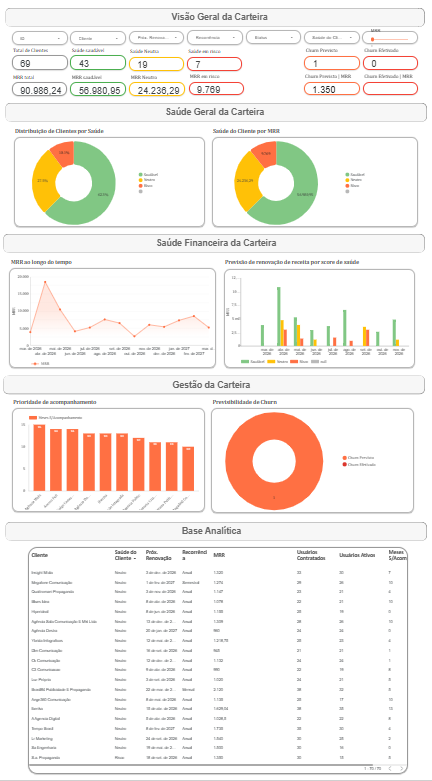

# 📊 Análise de Churn e Gestão de Carteira (SaaS)

## 🎯 Objetivo
Desenvolver um dashboard para monitorar a saúde da carteira de clientes, identificar riscos de churn e apoiar a tomada de decisão em Customer Success.

---

## 🛠️ Ferramentas utilizadas
- Excel (modelagem de dados)
- Looker Studio (visualização de dados)
- Análise exploratória de dados

---

## 📂 Dados
A base utilizada contém informações como:
- Nome do cliente
- ID do cliente
- MRR (receita recorrente mensal)
- Status de saúde do cliente
- Próxima data de renovação
- Tempo sem acompanhamento
- Quantidade de usuários ativos
- Quantidade de usuários contratados
Observação: Os dados utilizados neste projeto foram anonimizados para garantir a confidencialidade das informações.

---

## 📊 Análises realizadas
- Distribuição da saúde da carteira (saudável, atenção, risco)
- Identificação de clientes sem acompanhamento
- Receita em risco (MRR)
- Previsão de churn ao longo do tempo
- Priorização de clientes para atuação do time de CS

---

## 📈 Principais insights
- Parte relevante do risco está concentrada em poucos clientes de maior MRR
- Clientes com maior tempo sem acompanhamento apresentam maior propensão ao churn  
- Existem picos de churn previstos em determinados meses, indicando necessidade de ação preventiva  

---

## 🚀 Impacto do projeto
Este dashboard permite:
- Antecipar riscos de cancelamento  
- Priorizar ações de Customer Success  
- Aumentar previsibilidade de receita  

---

## 📸 Dashboard

